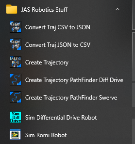

# FRC_LV_TrajLib_Utilities

This repository only has the install package for the FRC LV Trajectory Library utility programs.  This install package can be used to install only the utility programs when the rest of the library is not needed.

Windows start menu items are added for each of the utilities.

See
https://github.com/jsimpso81/FRC_LV_TrajLib

and
https://github.com/jsimpso81/FRC_LV_TrajLib_Util_and_Samp

for additional information.
